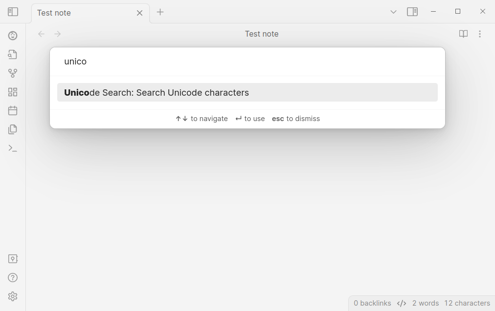
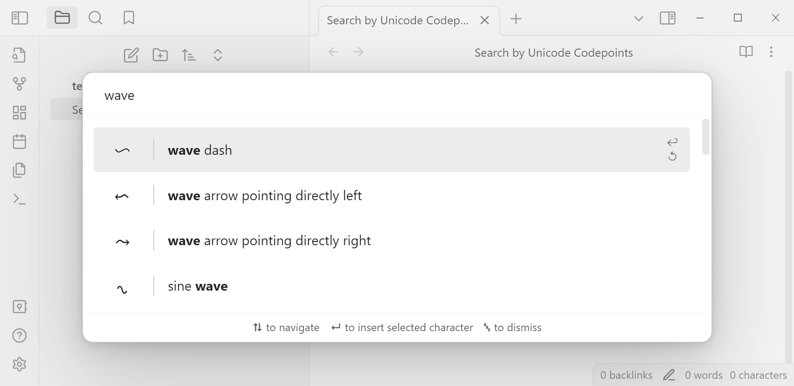
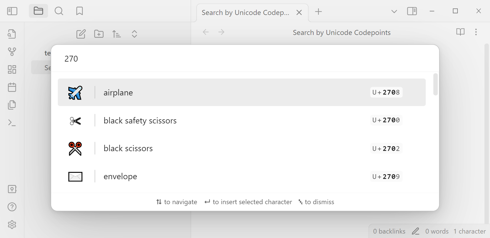

# Obsidian Unicode Search

Easily search the [Unicode Character Database](https://www.unicode.org/ucd/) index
and insert any character into your editor.
Mobile is also supported!

> *This is a plugin for [Obsidian](https://obsidian.md); [unicode-search](https://obsidian.md/plugins?id=unicode-search)*.

## Usage

The plugin adds a command for searching unicode characters.
Make sure to add a hotkey, like <kbd>Ctrl + Shift + O</kbd> for the command in the settings for Obsidian.

Just describe the character you're searching for
and press <kbd>↵</kbd> to insert it into the editor.
You can also search by Unicode codepoints!

