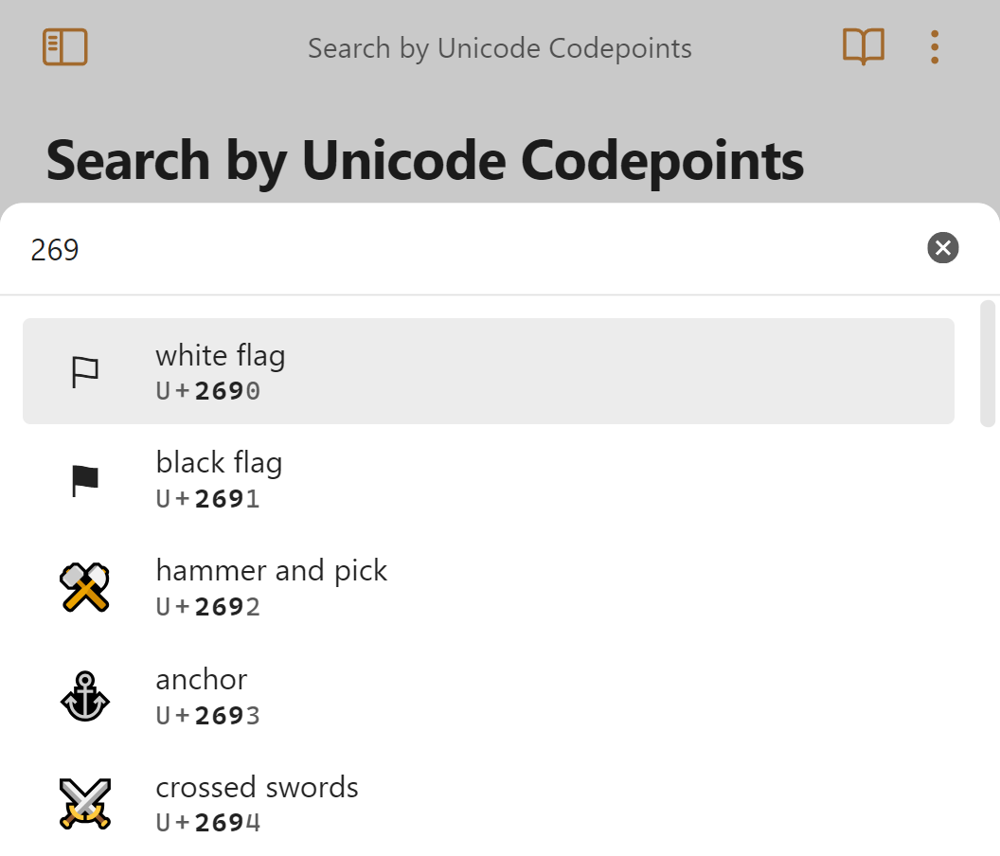

# Obsidian Unicode Search

> See [what's new](https://github.com/BambusControl/obsidian-unicode-search/releases)!

Search the [Unicode Character Database](https://www.unicode.org/ucd/) index
and insert any character into your editor.
Mobile is also supported!

> *This is a plugin for [Obsidian: unicode-search](https://obsidian.md/plugins?id=unicode-search)*.

## Usage

The plugin adds a command for searching unicode characters.
Make sure to add a hotkey, like <kbd>Ctrl + Shift + O</kbd> for the command in the settings for Obsidian.

Just describe the character you're searching for
and press <kbd>↵</kbd> to insert it into the editor.
You can also search by Unicode codepoints!

## Features

- **Fuzzy Search**: Find characters by name, codepoint, or keywords.
- **Direct Insert**: Insert characters directly into your editor.
- **Favorites & Hotkeys**: Mark frequently used characters as favorites and assign custom hotkeys for quick insertion.
- **Persistent Filters**: Configure and save filters for planes, categories, and custom sets to refine your searches.
- **Usage Statistics**: Quickly access frequently used symbols.
- **Configurable**: All settings are managed within Obsidian's settings pane.

## Using the Plugin

To begin using the plugin, launch the search by executing the **Search Unicode characters** command. For more convenient access, consider assigning a hotkey:

- Navigate to **Settings → Hotkeys**.
- Find **Search Unicode characters** and assign your preferred hotkey (e.g., `Ctrl+Shift+O`).

### Searching for Characters

Once the search modal is open, you can find characters by typing your query. This can be a descriptive term like `arrow` or `heart`, or a specific codepoint such as `269`.

- Use the `↑` and `↓` arrow keys to navigate through the search results.
- Press `Enter` to insert the selected character directly into your document.

### Managing Favorites

You can manage your favorite characters from the search modal by adding them in the plugin settings.

- View and manage all your favorites in **Settings → Unicode Search → Favorites**.
- Assign a hotkey to any favorite character via the plugin's settings tab. This creates a new command, "Insert '\<character>'", which can then have a hotkey assigned under **Settings → Hotkeys → Insert '\<character>'**.

### Filtering Characters

Character filters help you refine which characters appear in your search results. These are configured in **Settings → Unicode Search**.

- Toggle filters for various Unicode planes and categories.
- Define custom filters to tailor the search to your needs.
- Be aware that a default set of filters is active. If you're unable to find a specific character, it might be excluded by the current filter settings.
  - Search for your character to find out it's plane/block/category, if it's missing here: <https://www.compart.com/en/unicode>
